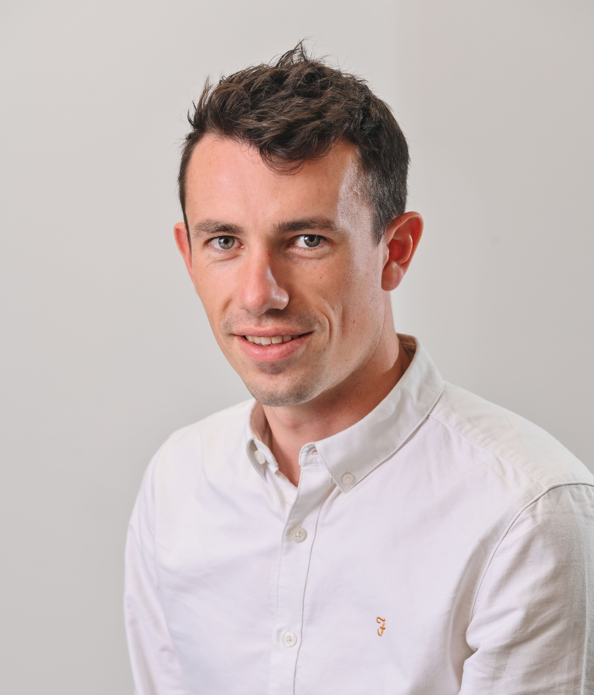

# About the author {- #author}

**Quentin Pilard (pilard.quentin@gmail.com)**

This tutorial is based on my professional experience working with RWD in collaboration with pharmaceutical industries and academia

```{r, echo=FALSE, fig.align='center', out.width='30%'}

```

