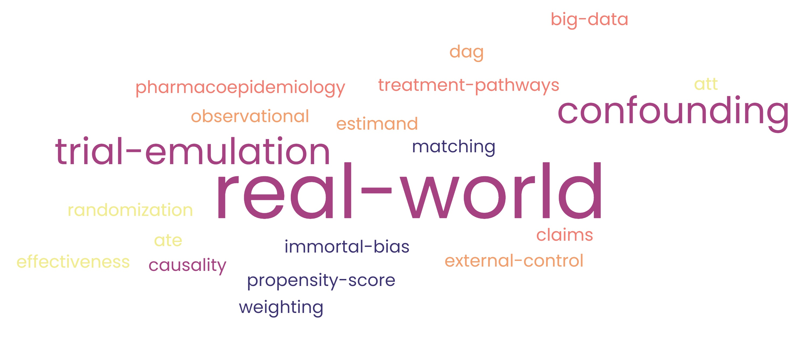

```{r setup, include=FALSE}
source("setup.R")
source("simulation.R")
```

# Welcome {.unnumbered}
This book provides a hands-on guide to analyzing Real World Data (RWD) using a motivating example and R code.

```{r, echo=FALSE, fig.align='center', out.width='80%'}

```

This book begins with **Chapter** \@ref(introduction), which offers an overview of Real World Data (RWD), highlighting key concepts and the challenges commonly encountered in this field.

Following this, a motivating example is introduced in **Chapter** \@ref(motivating-example), which will be used throughout the book to illustrate each subsequent chapter with practical R code for reproducibility.

The next chapters focus on approaches to limit these inherent biases:

-   **Chapter** \@ref(target-trial-emulation) presents the Hernán et al. framework, a key approach to TTE that strengthens the reliability of RWE to address inherent biases.

-   **Chapter** \@ref(iptw-application) focuses on propensity score techniques aiming to reduce confounding bias at baseline.

-   **Chapter** \@ref(clone-censor-weight) examines the clone-censor-weight approach, a method to limit both confounding and immortal bias in the context of time-varying treatments.


